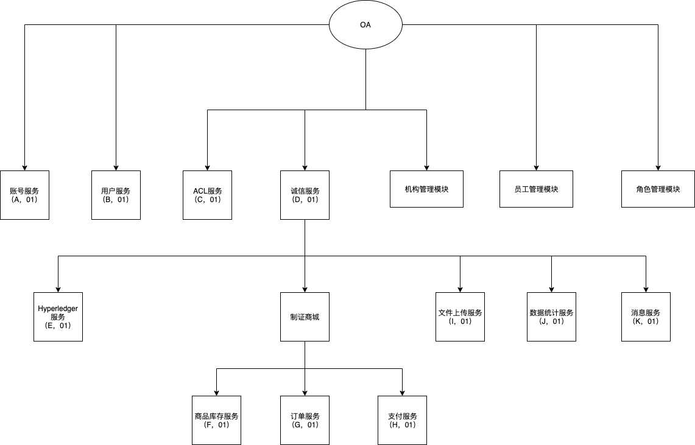
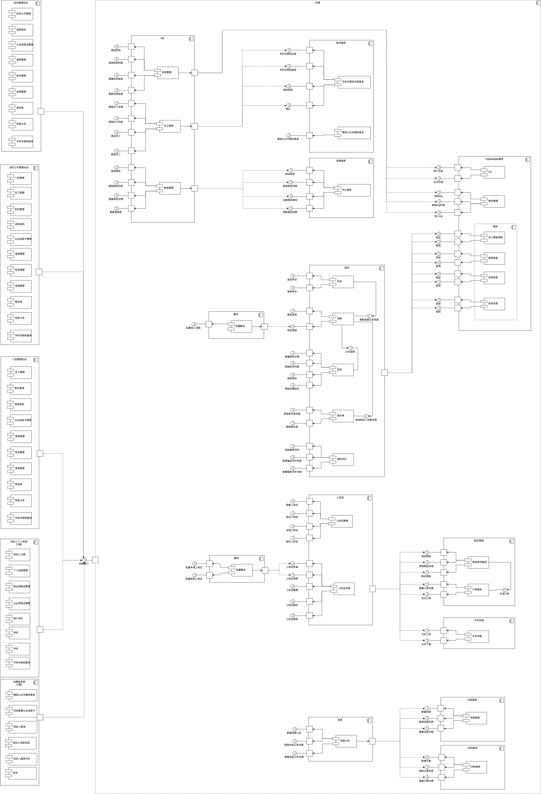
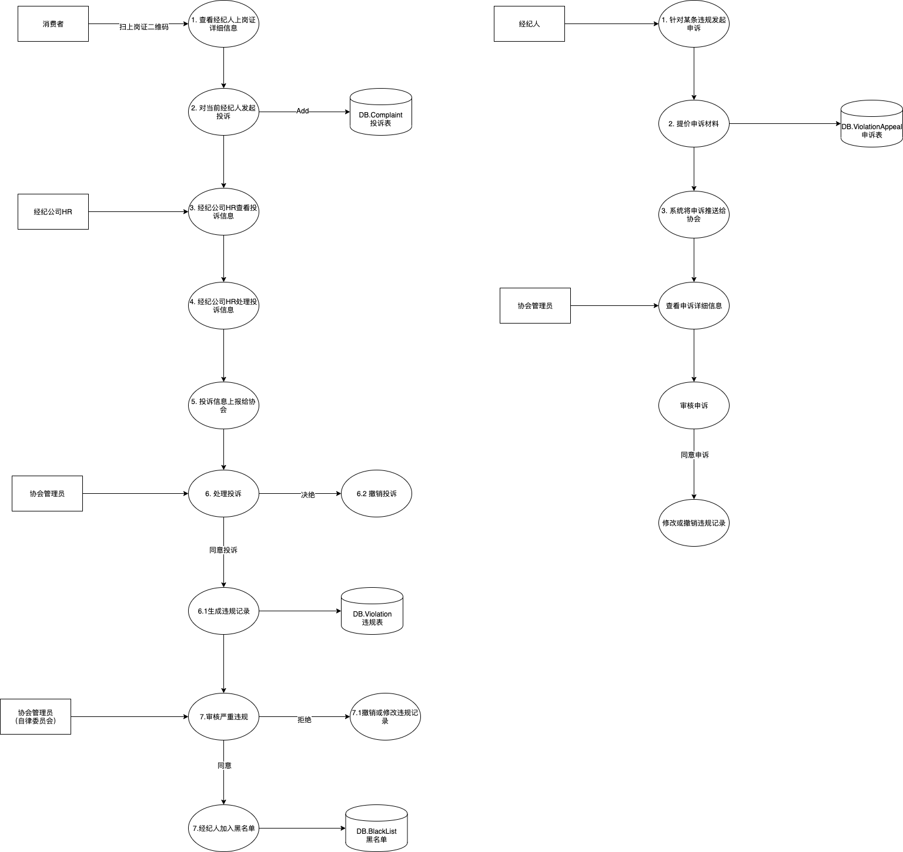
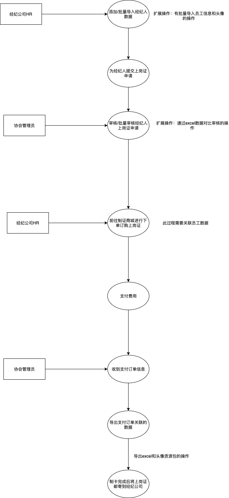
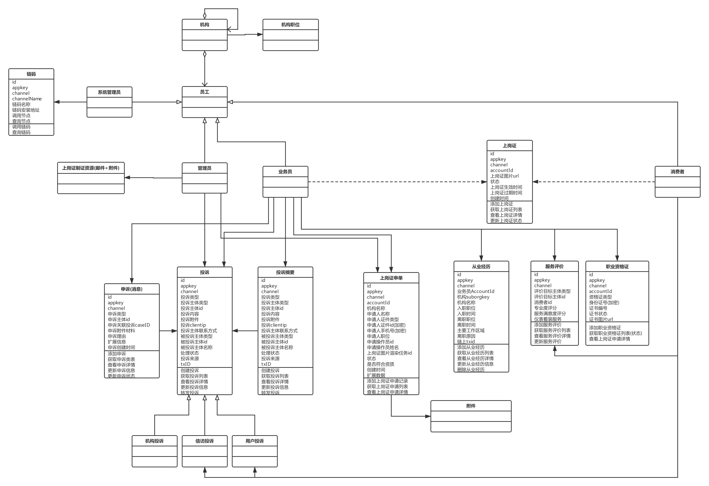
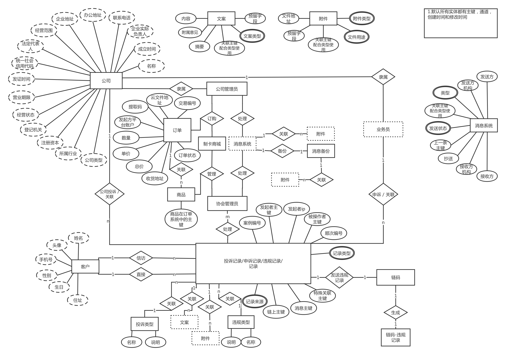

# 房产征信

## 服务引用图

## 用例图

### 顶层用例图

@startuml
left to right direction
用户 --> (业务管理员)
(业务管理员) ..> (机构管理): <<include>>
(机构管理) ..> (添加机构): <<include>>
(机构管理) ..> (获取机构列表): <<include>>
(机构管理) ..> (获取某机构详情): <<include>>
(机构管理) ..> (更新机构信息): <<include>>
(机构管理) ..> (删除机构): <<include>>
(业务管理员) ..> (角色管理): <<include>>
(角色管理) ..> (添加角色): <<include>>
(角色管理) ..> (获取角色列表): <<include>>
(角色管理) ..> (更新角色信息): <<include>>
(角色管理) ..> (删除角色): <<include>>
(业务管理员) ..> (员工管理): <<include>>
(员工管理) ..> (添加员工): <<include>>
(员工管理) ..> (批量导入员工): <<include>>
(员工管理) ..> (浏览员工列表): <<include>>
(员工管理) ..> (浏览员工列表): <<include>>
(员工管理) ..> (查看员工信息): <<include>>
(员工管理) ..> (更新员工信息): <<include>>
(员工管理) ..> (删除员工): <<include>>
(员工管理) ..> (申请工作证): <<include>>
(员工管理) ..> (挂失工作证): <<include>>
(业务管理员) ..> (诚信管理): <<include>>
(诚信管理) ..> (违规管理): <<include>>
(违规管理) ..> (添加违规记录): <<include>>
(违规管理) ..> (获取违规记录列表): <<include>>
(违规管理) ..> (审核违规记录): <<include>>
(违规管理) ..> (严重违规记录审核): <<include>>
(严重违规记录审核) ..> (浏览严重违规记录列表): <<include>>
(严重违规记录审核) ..> (查看严重违规记录详情): <<include>>
(严重违规记录审核) ..> (通过并添加经纪人到黑名单): <<include>>
(严重违规记录审核) ..> (处理严重违规记录): <<include>>
(处理严重违规记录) ..> (撤销严重违规记录): <<include>>
(处理严重违规记录) ..> (修改严重违规记录): <<include>>
(诚信管理) ..> (违规类型管理): <<include>>
(违规类型管理) ..> (添加违规类型): <<include>>
(违规类型管理) ..> (获取违规类型列表): <<include>>
(违规类型管理) ..> (更新违规类型): <<include>>
(诚信管理) ..> (投诉管理): <<include>>
(投诉管理) ..> (添加投诉): <<include>>
(投诉管理) ..> (获取投诉列表): <<include>>
(投诉管理) ..> (获取投诉详情): <<include>>
(投诉管理) ..> (更新投诉信息): <<include>>
(更新投诉信息) ..> (更新投诉信息备注): <<include>>
(更新投诉信息) ..> (转发投诉): <<include>>
(更新投诉信息) ..> (拒绝投诉): <<include>>
(诚信管理) ..> (申诉管理): <<include>>
(申诉管理) ..> (获取申诉列表): <<include>>
(申诉管理) ..> (更新申诉信息): <<include>>
(更新申诉信息) ..> (更新申诉状态：同意，拒绝): <<include>>
(更新申诉信息) ..> (更新申诉基础信息：备注等): <<include>>
(诚信管理) ..> (黑名单管理): <<include>>
(黑名单管理) ..> (获取黑名单列表): <<include>>
(黑名单管理) ..> (查看黑名单详情): <<include>>
(黑名单管理) ..> (审核黑名单): <<include>>
(业务管理员) ..> (上岗证管理): <<include>>
(上岗证管理) ..> (添加上岗证): <<include>>
(上岗证管理) ..> (获取上岗证列表): <<include>>
(上岗证管理) ..> (获取上岗证信息): <<include>>
(上岗证管理) ..> (更新上岗证信息): <<include>>
(更新上岗证信息) ..> (更新上岗证基础信息): <<include>>
(更新上岗证信息) ..> (更新上岗证的状态信息): <<include>>
(上岗证管理) ..> (下载上岗证): <<include>>
(上岗证管理) ..> (制证商城): <<include>>
(制证商城) ..> (制证商品管理): <<include>>
(制证商品管理) ..> (上架商品): <<include>>
(制证商品管理) ..> (下架商品): <<include>>
(制证商城) ..> (订单管理): <<include>>
(订单管理) ..> (查看订单列表): <<include>>
(订单管理) ..> (查看订单详情): <<include>>
(订单管理) ..> (下载订单关联数据): <<include>>
(下载订单关联数据) ..> (下载员工数据): <<include>>
(下载订单关联数据) ..> (下载员工头像数据): <<include>>
(制证商城) ..> (订购商品): <<include>>
(制证商城) ..> (选择订购商品扩展数据): <<include>>
(制证商城) ..> (订单管理): <<include>>
(订单管理) ..> (支付订单): <<include>>
(订单管理) ..> (查看订单物流信息): <<include>>
(业务管理员) ..> (消息管理): <<include>>
(消息管理) ..> (获取消息列表): <<include>>
(消息管理) ..> (查看消息详情): <<include>>
(消息管理) ..> (添加消息): <<include>>
(消息管理) ..> (下载消息附件): <<include>>
(业务管理员) ..> (服务评价): <<include>>
(服务评价) ..> (获取业务员服务评价列表): <<include>>
(服务评价) ..> (获取业务员服务评价详情): <<include>>
(业务管理员) ..> (职业资格证): <<include>>
(业务管理员) ..> (获取业务员职业资格证列表): <<include>>
(业务管理员) ..> (查看某业务员的职业资格详情): <<include>>
(业务管理员) ..> (审核业务员的职业资格证): <<include>>
(业务管理员) ..> (数据报告): <<include>>
(数据报告) ..> (从业信息卡[上岗证]分析): <<include>>
(数据报告) ..> (黑名单和违规分析): <<include>>
(数据报告) ..> (经纪公司综合分析): <<include>>
(数据报告) ..> (经纪人综合分析): <<include>>
(数据报告) ..> (消费者满意度分析): <<include>>
(数据报告) ..> (信访投诉分析): <<include>>
(数据报告) ..> (行业成交分析): <<include>>
用户 --> (业务员)
(业务员) ..> (查看自己的上岗证详情): <<include>>
(业务员) ..> (上岗证缴费): <<include>>
(业务员) ..> (上传职业资格证): <<include>>
(业务员) ..> (查看职业资格证): <<include>>
业务员 --> (违规)
(违规) ..> (浏览违规记录): <<include>>
(违规) ..> (查看违规详情): <<include>>
业务员 --> (申诉)
(申诉) ..> (提交申诉): <<include>>
(申诉) ..> (查看业务员自身的申诉详情): <<include>>
(申诉) ..> (获取业务员自己的申诉列表)
业务员 --> (信息公告): <<include>>
(信息公告) ..> (浏览信息公告): <<include>>
用户 --> (平台管理员)
(平台管理员) ..> (链码管理): <<include>>
(平台管理员) ..> (链机构管理): <<include>>
用户 --> (消费者)
(消费者) ..> (扫码查看上岗证详情): <<include>>
(扫码查看上岗证详情) ..> (查看经纪人违规记录): <<include>>
(扫码查看上岗证详情) ..> (查看经纪人服务评价): <<include>>
(扫码查看上岗证详情) ..> (查看经纪人所属信息): <<include>>
(消费者) ..> (投诉经纪人): <<include>>
(消费者) ..> (评价经纪人): <<include>>
@enduml

### 角色用例图

#### 角色说明

1. 经纪公司（链家，贝壳）

   1. 老板: 经纪公司的老板主要看相关行业报表
   2. HR：主要处理业务包含员工管理，投诉，违规管理，上岗证申请等
   3. 法务，对于线下已存在黑名单的经纪人 ，法务需要鉴定真实性并提交到系统

2. 加盟的门店与经纪
   1. 管理员：自己门店和行业的相关报表
   2. HR：主要处理业务包含员工管理，投诉，违规管理，上岗证申请等
   3. 业务员: 上岗证缴费，查看个人诚信数据，和申诉
3. 协会的角色关系
   1. 协会管理员：整个行业的报表数据，处理
   2. 自律委员会：针对严重违规二次审核，是否加入黑名单
4. 政府
   1. 市政府级：整个行业的报表数据
   2. 区政府级：整个行业的报表数据，处理投诉，经纪人查询

#### 协会管理员

@startuml
left to right direction
协会管理员 --> (经纪公司管理)
(经纪公司管理) ..> (获取经纪公司列表): <<include>>
(经纪公司管理) ..> (查看经纪公司详情): <<include>>
(经纪公司管理) ..> (更新经纪公司信息): <<include>>
(经纪公司管理) ..> (删除经纪公司): <<include>>
(经纪公司管理) ..> (经纪公司管理员管理): <<include>>
(经纪公司管理员管理) ..> (获取管理员列表): <<include>>
(经纪公司管理员管理) ..> (添加管理员): <<include>>
(经纪公司管理员管理) ..> (删除管理员): <<include>>
协会管理员 --> (诚信管理)
(诚信管理) ..> (黑名单): <<include>>
(黑名单) ..> (浏览黑名单列表): <<include>>
(黑名单) ..> (查看黑名单详情): <<include>>
(诚信管理) ..> (用户投诉): <<include>>
(用户投诉) ..> (浏览用户投诉列表): <<include>>
(用户投诉) ..> (查看用户投诉详情): <<include>>
(用户投诉) ..> (处理用户投诉): <<include>>
(处理用户投诉) ..> (拒绝投诉): <<include>>
(处理用户投诉) ..> (通过投诉并添加违规记录): <<include>>
(诚信管理) ..> (严重违规记录审核): <<include>>
(严重违规记录审核) ..> (浏览严重违规记录列表): <<include>>
(严重违规记录审核) ..> (查看严重违规记录详情): <<include>>
(严重违规记录审核) ..> (通过并添加经纪人到黑名单): <<include>>
(严重违规记录审核) ..> (处理严重违规记录): <<include>>
(处理严重违规记录) ..> (撤销严重违规记录): <<include>>
(处理严重违规记录) ..> (修改严重违规记录): <<include>>
(诚信管理) ..> (申诉管理): <<include>>
(申诉管理) ..> (浏览申诉列表): <<include>>
(申诉管理) ..> (查看申诉详情): <<include>>
(申诉管理) ..> (查看申诉关联违规详情): <<include>>
(申诉管理) ..> (处理申诉): <<include>>
(处理申诉) ..> (拒绝申诉): <<include>>
(处理申诉) ..> (同意申诉): <<include>>
(同意申诉) ..> (撤销违规记录): <<include>>
(同意申诉) ..> (修改违规记录): <<include>>
(诚信管理) ..> (违规类型管理): <<include>>
(违规类型管理) ..> (获取违规类型列表): <<include>>
(违规类型管理) ..> (查看违规类型详情): <<include>>
(违规类型管理) ..> (编辑违规类型信息): <<include>>
(违规类型管理) ..> (添加违规类型): <<include>>
(诚信管理) ..> (添加违规记录): <<include>>
协会管理员 --> (信用查看)
(信用查看) ..> (查询经纪人信用信息): <<include>>
(信用查看) ..> (查看经纪人基础信息): <<include>>
(信用查看) ..> (查看经纪人从业经历): <<include>>
(信用查看) ..> (查看经纪人违规记录): <<include>>
协会管理员 --> (上岗证管理)
(上岗证管理) ..> (浏览经纪公司上岗证申请列表): <<include>>
(上岗证管理) ..> (查看经纪公司内经纪人上岗证申请列表[条件]): <<include>>
(上岗证管理) ..> (查询经纪人上岗证申请信息[条件]): <<include>>
(上岗证管理) ..> (处理经纪人上岗证申请): <<include>>
(处理经纪人上岗证申请) ..> (批量通过): <<include>>
(处理经纪人上岗证申请) ..> (批量拒绝): <<include>>
(处理经纪人上岗证申请) ..> (一键审核通过): <<include>>
协会管理员 --> (制证商城)
(制证商城) ..> (制证商品管理): <<include>>
(制证商品管理) ..> (上架商品): <<include>>
(制证商品管理) ..> (下架商品): <<include>>
(制证商城) ..> (订单管理): <<include>>
(订单管理) ..> (查看订单列表): <<include>>
(订单管理) ..> (查看订单详情): <<include>>
(订单管理) ..> (下载订单关联数据): <<include>>
(下载订单关联数据) ..> (下载员工数据): <<include>>
(下载订单关联数据) ..> (下载员工头像数据): <<include>>
(订单管理) ..> (支付订单): <<include>>
(订单管理) ..> (查看订单物流信息): <<include>>
协会管理员 --> (信息公告)
(信息公告) ..> (浏览信息公告列表): <<include>>
(信息公告) ..> (查看信息公告详情): <<include>>
(信息公告) ..> (发布信息公告): <<include>>
协会管理员 --> (数据报告)
(数据报告) ..> (从业信息卡[上岗证]分析): <<include>>
(数据报告) ..> (黑名单和违规分析): <<include>>
(数据报告) ..> (经纪公司综合分析): <<include>>
(数据报告) ..> (经纪人综合分析): <<include>>
(数据报告) ..> (消费者满意度分析): <<include>>
(数据报告) ..> (信访投诉分析): <<include>>
(数据报告) ..> (行业成交分析): <<include>>
@enduml

#### 协会自律委员会

@startuml
left to right direction
协会自律委员会 --> (严重违规记录)
(严重违规记录) ..> (浏览严重违规记录列表): <<include>>
(严重违规记录) ..> (查看严重违规记录详情): <<include>>
(严重违规记录) ..> (审核严重违规记录): <<include>>
(审核严重违规记录) ..> (通过并将经纪人加入到黑名单): <<include>>
(审核严重违规记录) ..> (撤销违规记录): <<include>>
(审核严重违规记录) ..> (修改违规记录): <<include>>
(严重违规记录) ..> (添加严重违规记录): <<include>>
@enduml

#### 市政府

@startuml
left to right direction
市政府 --> (数据报告)
(数据报告) ..> (从业信息卡[上岗证]分析): <<include>>
(数据报告) ..> (黑名单和违规分析): <<include>>
(数据报告) ..> (经纪公司综合分析): <<include>>
(数据报告) ..> (经纪人综合分析): <<include>>
(数据报告) ..> (消费者满意度分析): <<include>>
(数据报告) ..> (信访投诉分析): <<include>>
(数据报告) ..> (行业成交分析): <<include>>
@enduml

#### 区政府

@startuml
left to right direction
区政府 --> (数据报告)
(数据报告) ..> (从业信息卡[上岗证]分析): <<include>>
(数据报告) ..> (黑名单和违规分析): <<include>>
(数据报告) ..> (经纪公司综合分析): <<include>>
(数据报告) ..> (经纪人综合分析): <<include>>
(数据报告) ..> (消费者满意度分析): <<include>>
(数据报告) ..> (信访投诉分析): <<include>>
(数据报告) ..> (行业成交分析): <<include>>
区政府 --> (用户投诉)
(用户投诉) ..> (浏览用户投诉列表): <<include>>
(用户投诉) ..> (添加用户投诉): <<include>>
区政府 --> (信访投诉)
(用户投诉) ..> (浏览信访投诉列表): <<include>>
(用户投诉) ..> (添加信访投诉): <<include>>
区政府 --> (经纪人信息)
(经纪人信息) ..> (浏览经纪人列表): <<include>>
(经纪人信息) ..> (查询经纪人详情): <<include>>
@enduml

#### 经纪公司管理员

@startuml
left to right direction
经纪公司管理员 --> (诚信报告)
(诚信报告) ..> (本机构诚信报告): <<include>>
(诚信报告) ..> (行业诚信概括): <<include>>
(诚信报告) ..> (经纪人综合分析): <<include>>
经纪公司管理员 --> (信访)
(信访) ..> (浏览信访列表): <<include>>
(信访) ..> (查看信访详情): <<include>>
经纪公司管理员 --> (经纪公司投诉)
(经纪公司投诉) ..> (添加经纪公司投诉): <<include>>
(经纪公司投诉) ..> (获取经纪公司投诉列表): <<include>>
(经纪公司投诉) ..> (查看经纪公司投诉详情): <<include>>
经纪公司管理员 --> (信息公告)
(信息公告) ..> (浏览信息公告): <<include>>
@enduml

#### 经纪公司 HR

@startuml
left to right direction
经纪公司HR --> (门店管理)
(门店管理) ..> (新增门店): <<include>>
(门店管理) ..> (浏览门店列表): <<include>>
(门店管理) ..> (查看门店详情): <<include>>
(门店管理) ..> (修改门店信息): <<include>>
经纪公司HR --> (职位管理)
(职位管理) ..> (获取职位列表): <<include>>
(职位管理) ..> (添加职位): <<include>>
(职位管理) ..> (修改职位信息): <<include>>
经纪公司HR --> (员工管理)
(员工管理) ..> (获取员工列表): <<include>>
(员工管理) ..> (查看员工详情): <<include>>
(员工管理) ..> (添加员工): <<include>>
(添加员工) ..> (手工录入员工): <<include>>
(添加员工) ..> (批量导入): <<include>>
(员工管理) ..> (修改员工信息): <<include>>
经纪公司HR --> (违规管理)
(违规管理) ..> (违规记录): <<include>>
(违规记录) ..> (查看本机构的违规记录列表): <<include>>
(违规记录) ..> (查询某经纪人的违规记录信息): <<include>>
(违规记录) ..> (添加违规记录): <<include>>
(添加违规记录) ..> (手动添加经纪人的违规记录): <<include>>
(添加违规记录) ..> (批量导入经纪人的违规记录): <<include>>
(违规管理) ..> (用户投诉): <<include>>
(用户投诉) ..> (获取用户投诉投诉列表[按条件]): <<include>>
(用户投诉) ..> (查看用户投诉详情): <<include>>
(用户投诉) ..> (处理用户投诉意见): <<include>>
(违规管理) ..> (信访投诉): <<include>>
(信访投诉) ..> (获取信访投诉列表[条件]): <<include>>
(信访投诉) ..> (浏览信访投诉列表): <<include>>
(信访投诉) ..> (查看信访投诉详情): <<include>>
(信访投诉) ..> (处理信访投诉): <<include>>
经纪公司HR --> (上岗证)
(上岗证) ..> (申请上岗证): <<include>>
(申请上岗证) ..> (手动申请[批量]): <<include>>
(申请上岗证) ..> (一键申请申请上岗证): <<include>>
(申请上岗证) ..> (批量导入申请): <<include>>
(上岗证) ..> (查看上岗证申请记录): <<include>>
经纪公司HR --> (制证商城)
(制证商城) ..> (订购商品): <<include>>
(制证商城) ..> (选择关联订购商品扩展数据): <<include>>
(制证商城) ..> (订单管理): <<include>>
(订单管理) ..> (查看订单列表): <<include>>
(订单管理) ..> (查看订单详情): <<include>>
(订单管理) ..> (支付订单): <<include>>
(订单管理) ..> (查看订单物流信息): <<include>>
经纪公司HR --> (信息公告)
(信息公告) ..> (浏览信息公告列表): <<include>>
(信息公告) ..> (查看信息公告详情): <<include>>
@enduml

#### 经纪公司法务

@startuml
left to right direction
经纪公司法务 --> (黑名单)
(黑名单) ..> (添加黑名单记录): <<include>>
(黑名单) ..> (查看黑名单列表): <<include>>
(黑名单) ..> (上报黑名单到协会): <<include>>
@enduml

#### 门店管理员

@startuml
left to right direction
门店管理员 --> (诚信报告)
(诚信报告) ..> (本门店诚信报告): <<include>>
(诚信报告) ..> (行业诚信概括): <<include>>
(诚信报告) ..> (经纪人综合分析): <<include>>
门店管理员 --> (信访)
(信访) ..> (浏览信访列表): <<include>>
(信访) ..> (查看信访详情): <<include>>
门店管理员 --> (门店投诉): <<include>>
(门店投诉) ..> (添加门店投诉): <<include>>
(门店投诉) ..> (获取门店投诉列表): <<include>>
(门店投诉) ..> (查看门店投诉详情): <<include>>
门店管理员 --> (信息公告)
(信息公告) ..> (浏览信息公告): <<include>>
@enduml

#### 门店 HR

@startuml
left to right direction
门店HR --> (员工管理)
(员工管理) ..> (获取员工列表): <<include>>
(员工管理) ..> (查看员工详情): <<include>>
(员工管理) ..> (添加员工): <<include>>
(添加员工) ..> (手工录入员工): <<include>>
(添加员工) ..> (批量导入): <<include>>
(员工管理) ..> (修改员工信息): <<include>>
门店HR --> (违规管理)
(违规管理) ..> (违规记录): <<include>>
(违规记录) ..> (查看本机构的违规记录列表): <<include>>
(违规记录) ..> (查询某经纪人的违规记录信息): <<include>>
(违规记录) ..> (添加违规记录): <<include>>
(添加违规记录) ..> (手动添加经纪人的违规记录): <<include>>
(添加违规记录) ..> (批量导入经纪人的违规记录): <<include>>
(违规管理) ..> (用户投诉): <<include>>
(用户投诉) ..> (获取用户投诉投诉列表[按条件]): <<include>>
(用户投诉) ..> (查看用户投诉详情): <<include>>
(用户投诉) ..> (处理用户投诉意见): <<include>>
门店HR --> (上岗证)
(上岗证) ..> (申请上岗证): <<include>>
(申请上岗证) ..> (手动申请[批量]): <<include>>
(申请上岗证) ..> (一键申请申请上岗证): <<include>>
(申请上岗证) ..> (批量导入申请): <<include>>
(上岗证) ..> (查看上岗证申请记录): <<include>>
门店HR --> (信息公告)
(信息公告) ..> (浏览信息公告列表): <<include>>
(信息公告) ..> (查看信息公告详情): <<include>>
@enduml

#### 业务员

@startuml
left to right direction
业务员 --> (上岗证)
(上岗证) ..> (查看上岗证详情): <<include>>
(上岗证) ..> (上岗证缴费): <<include>>
业务员 --> (职业资格证)
(职业资格证) ..> (上传职业资格证): <<include>>
(职业资格证) ..> (查看职业资格证): <<include>>
业务员 --> (违规)
(违规) ..> (浏览违规记录): <<include>>
(违规) ..> (查看违规详情): <<include>>
业务员 --> (申诉)
(申诉) ..> (提交申诉): <<include>>
(申诉) ..> (查看申诉详情): <<include>>
(申诉) ..> (获取申诉列表)
业务员 --> (信息公告): <<include>>
(信息公告) ..> (浏览信息公告): <<include>>
@enduml

#### 消费者

@startuml
left to right direction
消费者 --> (上岗证)
(上岗证) ..> (扫码查看上岗证详情): <<include>>
消费者 --> (查看经纪人个人信息)
(查看经纪人个人信息) ..> (查看经纪人违规记录): <<include>>
(查看经纪人个人信息) ..> (查看经纪人服务评价): <<include>>
(查看经纪人个人信息) ..> (查看经纪人所属信息): <<include>>
消费者 --> (投诉经纪人)
消费者 --> (评价经纪人)
@enduml

### 详细用例图

##  构件图

## 数据流图

### 用户投诉，违规和黑名单

### 上岗证

## 类图

## E-R 图

## 数据表设计

## 接口设计

### 经纪人违规表 agent_violation

| 列                | 类型                          | 注释                                                                             |
| ----------------- | ----------------------------- | -------------------------------------------------------------------------------- |
| id                | int(11) 自动增量              |
| appkey            | varchar(50) []                | appkey                                                                           |
| channel           | int(11) [0]                   | channelID                                                                        |
| agentAccountID    | varchar(64)                   | 经纪人 id                                                                        |
| certificateNumber | varchar(50)                   | 身份证号                                                                         |
| name              | varchar(50)                   | 用户名                                                                           |
| status            | tinyint(4) [2]                | 记录状态 1：待审核 2：审核通过 3：审核不通过添加其他违规 4：审核不通过撤销违规   |
| from              | tinyint(4) [1]                | 1：公司；2：区交易中心；3：区房管局；4：公安；5：工商（默认公司）；6：消费者投诉 |
| orgID             | varchar(64)                   | 经纪公司 ID                                                                      |
| txID              | varchar(100)                  | 链上插入成功返回的交易编号（调用链接口返回的参数                                 |
| violationDate     | datetime                      | 违规日期                                                                         |
| violationType     | int(11)                       | 违规类型，关联违规类型表的 id                                                    |
| violationReason   | varchar(200)                  | 违规具体内容                                                                     |
| created_at        | timestamp [CURRENT_TIMESTAMP] |
| updated_at        | timestamp [CURRENT_TIMESTAMP] |

### 违规类型表 violation_type

| 列            | 类型                          | 注释      |
| ------------- | ----------------------------- | --------- |
| id            | int(11) 自动增量              |
| violationName | varchar(50)                   | 失信名称  |
| description   | text                          | 违规描述  |
| appkey        | varchar(50) []                | appkey    |
| channel       | int(11) [0]                   | channelID |
| created_at    | timestamp [CURRENT_TIMESTAMP] |
| updated_at    | timestamp [CURRENT_TIMESTAMP] |

### 申诉 agent_violation_appeal

| 列                | 类型                          | 注释                                                   |
| ----------------- | ----------------------------- | ------------------------------------------------------ |
| id                | int(11) 自动增量              |
| appkey            | varchar(50) []                | appkey                                                 |
| channel           | int(11) [0]                   | channelID                                              |
| accountID         | varchar(64) []                | agent 的 accountID                                     |
| name              | varchar(50) []                | 经纪人姓名                                             |
| certificateNumber | varchar(60) []                | 身份证号（加密）                                       |
| status            | tinyint(4) [1]                | 审核状态 1：待审核 2：通过并撤销 3：通过并修改 4：拒绝 |
| currentViolation  | text                          | 新的违规记录，修改违规记录时更新该字段                 |
| material          | text                          | 申诉材料 url                                           |
| excelUrl          | text                          | 附件 excel 的 URL                                      |
| reason            | varchar(255) []               | 申诉理由                                               |
| args              | text                          | 扩展参数                                               |
| created_at        | timestamp [CURRENT_TIMESTAMP] |
| updated_at        | timestamp [CURRENT_TIMESTAMP] |

### 投诉表 complaint

| 列               | 类型                          | 注释                                      |
| ---------------- | ----------------------------- | ----------------------------------------- |
| id               | int(11) 自动增量              |
| appkey           | varchar(50) []                | appkey                                    |
| channel          | varchar(50) []                | channel                                   |
| type             | varchar(50) []                | 投诉类型：1:用户对经纪人投诉 ,2:经纪公司对经纪公司投诉, 3:用户对经纪人信访，4：用户对经纪公司信访|
| complaintChannel | smallint(6) [0]               | 投诉公司的 channel                        |
| complaintTel     | varchar(20) []                | 投诉公司的联系电话                        |
| orgName          | varchar(50) []                | 投诉方机构名称                            |
| channel          | smallint(6) [0]               | 被投诉公司的 channel                      |
| companyName      | varchar(50) []                | 被投诉非平台会员公司名，与 channel 二选一 |
| tel              | varchar(20) []                | 被投诉公司的联系电话                      |
| material         | text                          | 处理材料 URL                              |
| status           | tinyint(4) [1]                | 1:待处理 2:处理中 3:已处理                |
| processResult    | text                          | 处理意见                                  |
| reason           | varchar(255) []               | 投诉理由                                  |
| created_at       | timestamp [CURRENT_TIMESTAMP] |
| updated_at       | timestamp [CURRENT_TIMESTAMP] |
