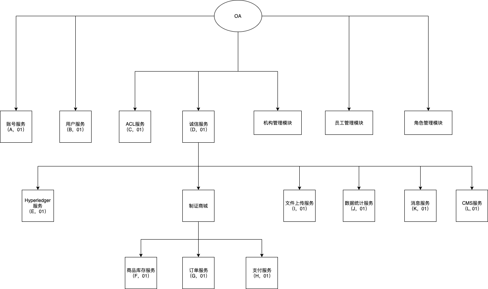
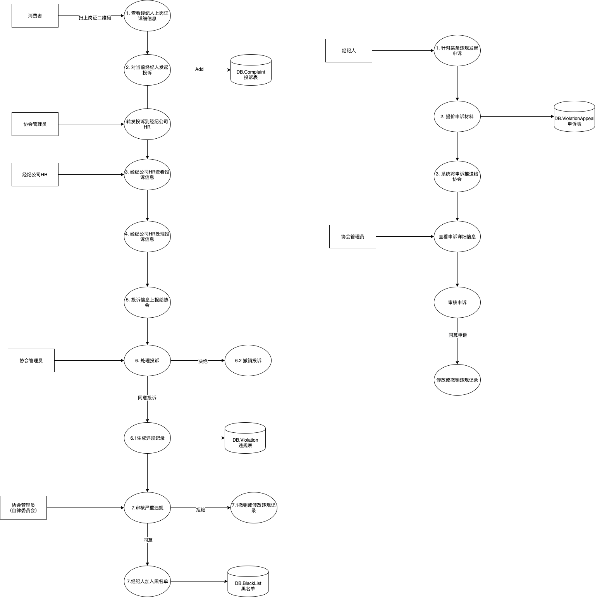
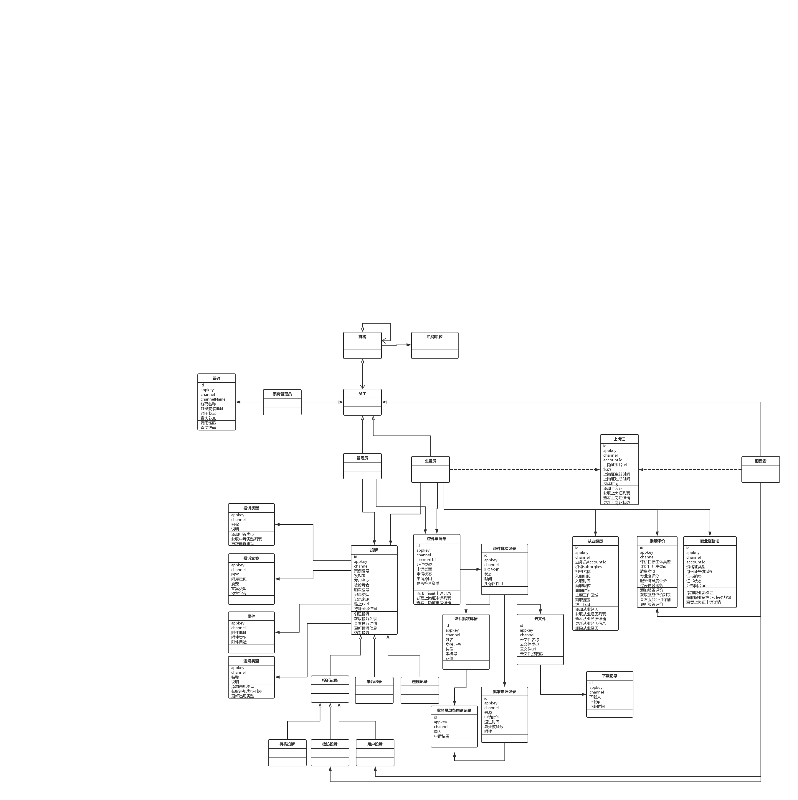

# 房产征信

## 服务引用图

## 用例图

### 顶层用例图

@startuml
left to right direction
用户 --> (业务管理员)
(业务管理员) ..> (机构管理): <<include>>
(机构管理) ..> (添加机构): <<include>>
(机构管理) ..> (获取机构列表): <<include>>
(机构管理) ..> (递归获取子机构列表): <<include>>
(机构管理) ..> (获取某机构详情): <<include>>
(机构管理) ..> (更新机构信息): <<include>>
(机构管理) ..> (删除机构): <<include>>
(业务管理员) ..> (角色管理): <<include>>
(角色管理) ..> (添加角色): <<include>>
(角色管理) ..> (获取角色列表): <<include>>
(角色管理) ..> (更新角色信息): <<include>>
(角色管理) ..> (删除角色): <<include>>
(业务管理员) ..> (员工管理): <<include>>
(员工管理) ..> (添加员工): <<include>>
(员工管理) ..> (批量导入员工): <<include>>
(员工管理) ..> (浏览员工列表): <<include>>
(员工管理) ..> (浏览员工列表): <<include>>
(浏览员工列表) ..> (浏览当前机构的员工列表): <<include>>
(浏览员工列表) ..> (浏览子机构的员工列表): <<include>>
(浏览员工列表) ..> (浏览子机构的某部门的员工列表): <<include>>
(员工管理) ..> (查看员工信息): <<include>>
(员工管理) ..> (更新员工信息): <<include>>
(员工管理) ..> (删除员工): <<include>>
(员工管理) ..> (申请工作证): <<include>>
(员工管理) ..> (挂失工作证): <<include>>
(业务管理员) ..> (诚信管理): <<include>>
(诚信管理) ..> (投诉管理): <<include>>
(投诉管理) ..> (添加投诉): <<include>>
(投诉管理) ..> (获取投诉列表): <<include>>
(投诉管理) ..> (获取投诉详情): <<include>>
(投诉管理) ..> (更新投诉信息): <<include>>
(更新投诉信息) ..> (更新投诉信息备注): <<include>>
(更新投诉信息) ..> (转发投诉): <<include>>
(更新投诉信息) ..> (拒绝投诉): <<include>>
(投诉管理) ..> (处理转发投诉消息): <<include>>
(投诉管理) ..> (审核投诉记录): <<include>>
(投诉管理) ..> (严重投诉记录审核): <<include>>
(严重投诉记录审核) ..> (浏览严重投诉记录列表): <<include>>
(严重投诉记录审核) ..> (查看严重投诉记录详情): <<include>>
(严重投诉记录审核) ..> (设置经纪人为黑名单用户): <<include>>
(严重投诉记录审核) ..> (处理严重投诉记录): <<include>>
(处理严重投诉记录) ..> (撤销严重投诉记录): <<include>>
(处理严重投诉记录) ..> (修改严重投诉记录): <<include>>
(投诉管理) ..> (查看投诉摘要): <<include>>
(诚信管理) ..> (申诉管理): <<include>>
(申诉管理) ..> (获取申诉列表): <<include>>
(申诉管理) ..> (更新申诉信息): <<include>>
(更新申诉信息) ..> (更新申诉状态：同意，拒绝): <<include>>
(更新申诉信息) ..> (更新申诉基础信息：备注等): <<include>>
(诚信管理) ..> (黑名单管理): <<include>>
(黑名单管理) ..> (获取黑名单列表): <<include>>
(黑名单管理) ..> (查看黑名单详情): <<include>>
(黑名单管理) ..> (审核黑名单): <<include>>
(业务管理员) ..> (上岗证管理): <<include>>
(上岗证管理) ..> (添加上岗证): <<include>>
(上岗证管理) ..> (获取上岗证列表): <<include>>
(上岗证管理) ..> (获取上岗证信息): <<include>>
(上岗证管理) ..> (更新上岗证信息): <<include>>
(更新上岗证信息) ..> (更新上岗证基础信息): <<include>>
(更新上岗证信息) ..> (更新上岗证的状态信息): <<include>>
(上岗证管理) ..> (下载上岗证): <<include>>
(上岗证管理) ..> (制证商城): <<include>>
(制证商城) ..> (制证商品管理): <<include>>
(制证商品管理) ..> (上架商品): <<include>>
(制证商品管理) ..> (下架商品): <<include>>
(制证商城) ..> (订单管理): <<include>>
(订单管理) ..> (查看订单列表): <<include>>
(订单管理) ..> (查看订单详情): <<include>>
(订单管理) ..> (下载订单关联数据): <<include>>
(下载订单关联数据) ..> (下载员工数据): <<include>>
(下载订单关联数据) ..> (下载员工头像数据): <<include>>
(制证商城) ..> (订购商品): <<include>>
(制证商城) ..> (选择订购商品扩展数据): <<include>>
(制证商城) ..> (订单管理): <<include>>
(订单管理) ..> (支付订单): <<include>>
(订单管理) ..> (查看订单物流信息): <<include>>
(业务管理员) ..> (消息管理): <<include>>
(消息管理) ..> (获取消息列表): <<include>>
(消息管理) ..> (查看消息详情): <<include>>
(消息管理) ..> (添加消息): <<include>>
(消息管理) ..> (下载消息附件): <<include>>
(业务管理员) ..> (服务评价): <<include>>
(服务评价) ..> (获取业务员服务评价列表): <<include>>
(服务评价) ..> (获取业务员服务评价详情): <<include>>
(业务管理员) ..> (职业资格证管理): <<include>>
(职业资格证管理) ..> (添加职业资格证): <<include>>
(职业资格证管理) ..> (批量导入职业资格证): <<include>>
(职业资格证管理) ..> (获取业务员职业资格证列表): <<include>>
(职业资格证管理) ..> (查看某业务员的职业资格详情): <<include>>
(职业资格证管理) ..> (审核业务员的职业资格证): <<include>>
(业务管理员) ..> (数据报告): <<include>>
(数据报告) ..> (从业信息卡[上岗证]分析): <<include>>
(从业信息卡[上岗证]分析)..> (获取从业信息卡基础统计信息): <<include>>
(从业信息卡[上岗证]分析)..> (获取从业信息卡的新增统计信息): <<include>>
(从业信息卡[上岗证]分析)..> (获取各公司持卡详细信息): <<include>>
(数据报告) ..> (黑名单和违规分析): <<include>>
(黑名单和违规分析) ..> (获取黑名单基础统计信息): <<include>>
(黑名单和违规分析) ..> (获取黑名单和违规统计信息): <<include>>
(黑名单和违规分析) ..> (获取各个公司黑名单和违规信息): <<include>>
(数据报告) ..> (经纪公司综合分析): <<include>>
(经纪公司综合分析) ..> (获取经纪公司基础统计信息): <<include>>
(经纪公司综合分析) ..> (获取经纪公司排名统计信息): <<include>>
(经纪公司综合分析) ..> (获取经纪公司排名统计信息): <<include>>
(数据报告) ..> (经纪人综合分析): <<include>>
(经纪人综合分析) ..> (获取经纪人基础统计信息): <<include>>
(经纪人综合分析) ..> (获取经纪人入职离职统计信息): <<include>>
(经纪人综合分析) ..> (获取经纪人综合统计信息): <<include>>
(经纪人综合分析) ..> (获取经纪公司经纪人统计信息): <<include>>
(经纪人综合分析) ..> (获取经纪人从业年限统计信息): <<include>>
(经纪人综合分析) ..> (获取离职经纪人从业年限统计信息): <<include>>
(数据报告) ..> (消费者满意度分析): <<include>>
(消费者满意度分析) ..> (获取消费者满意基础统计信息): <<include>>
(消费者满意度分析) ..> (获取各个经纪公司消费满意度排名): <<include>>
(数据报告) ..> (信访投诉分析): <<include>>
(信访投诉分析) ..> (获取信访投诉基础统计信息): <<include>>
(信访投诉分析) ..> (获取信访投诉新增统计信息): <<include>>
(信访投诉分析) ..> (获取信访投诉排名统计): <<include>>
(数据报告) ..> (行业成交分析): <<include>>
(行业成交分析) ..> (获取行业成交基础信息): <<include>>
(行业成交分析) ..> (获取周期时间的行业成交趋势): <<include>>
(行业成交分析) ..> (获取行业房源基础信息): <<include>>
(行业成交分析) ..> (获取行业房源机构统计信息): <<include>>
用户 --> (业务员)
(业务员) ..> (查看自己的上岗证详情): <<include>>
(业务员) ..> (上岗证缴费): <<include>>
(业务员) ..> (上传职业资格证): <<include>>
(业务员) ..> (查看职业资格证): <<include>>
业务员 --> (投诉)
(投诉) ..> (浏览投诉记录): <<include>>
(投诉) ..> (查看自己的投诉摘要): <<include>>
业务员 --> (申诉)
(申诉) ..> (提交申诉): <<include>>
(申诉) ..> (查看业务员自身的申诉详情): <<include>>
(申诉) ..> (获取业务员自己的申诉列表)
业务员 --> (信息公告): <<include>>
(信息公告) ..> (浏览信息公告): <<include>>
用户 --> (平台管理员)
(平台管理员) ..> (链码管理): <<include>>
(平台管理员) ..> (链机构管理): <<include>>
用户 --> (消费者)
(消费者) ..> (扫码查看上岗证详情): <<include>>
(扫码查看上岗证详情) ..> (查看经纪人违规记录): <<include>>
(扫码查看上岗证详情) ..> (查看经纪人服务评价): <<include>>
(扫码查看上岗证详情) ..> (查看经纪人所属信息): <<include>>
(消费者) ..> (投诉经纪人): <<include>>
(消费者) ..> (评价经纪人): <<include>>
@enduml

### 角色用例图

#### 角色说明

1. 经纪公司（链家，贝壳）

   1. 老板: 经纪公司的老板主要看相关行业报表
   2. HR：主要处理业务包含员工管理，投诉，违规管理，上岗证申请等
   3. 法务，对于线下已存在黑名单的经纪人 ，法务需要鉴定真实性并提交到系统

2. 加盟的门店与经纪
   1. 管理员：自己门店和行业的相关报表
   2. HR：主要处理业务包含员工管理，投诉，违规管理，上岗证申请等
   3. 业务员: 上岗证缴费，查看个人诚信数据，和申诉
3. 协会的角色关系
   1. 协会管理员：整个行业的报表数据，处理
   2. 自律委员会：针对严重违规二次审核，是否加入黑名单
4. 政府
   1. 市政府级：整个行业的报表数据
   2. 区政府级：整个行业的报表数据，处理投诉，经纪人查询

#### 协会管理员

@startuml
left to right direction
协会管理员 --> (经纪公司管理)
(经纪公司管理) ..> (获取经纪公司列表): <<include>>
(经纪公司管理) ..> (查看经纪公司详情): <<include>>
(经纪公司管理) ..> (更新经纪公司信息): <<include>>
(经纪公司管理) ..> (删除经纪公司): <<include>>
(经纪公司管理) ..> (经纪公司管理员管理): <<include>>
(经纪公司管理员管理) ..> (获取管理员列表): <<include>>
(经纪公司管理员管理) ..> (添加管理员): <<include>>
(经纪公司管理员管理) ..> (删除管理员): <<include>>
协会管理员 --> (诚信管理)
(诚信管理) ..> (黑名单): <<include>>
(黑名单) ..> (浏览黑名单列表): <<include>>
(黑名单) ..> (查看黑名单详情): <<include>>
(诚信管理) ..> (投诉管理): <<include>>
(投诉管理) ..> (添加投诉): <<include>>
(投诉管理) ..> (获取投诉列表): <<include>>
(投诉管理) ..> (获取投诉详情): <<include>>
(投诉管理) ..> (更新投诉信息): <<include>>
(更新投诉信息) ..> (更新投诉信息备注): <<include>>
(更新投诉信息) ..> (转发投诉): <<include>>
(更新投诉信息) ..> (拒绝投诉): <<include>>
(投诉管理) ..> (处理转发投诉消息): <<include>>
(投诉管理) ..> (审核投诉记录): <<include>>
(投诉管理) ..> (严重投诉记录审核): <<include>>
(严重投诉记录审核) ..> (浏览严重投诉记录列表): <<include>>
(严重投诉记录审核) ..> (查看严重投诉记录详情): <<include>>
(严重投诉记录审核) ..> (设置经纪人为黑名单用户): <<include>>
(严重投诉记录审核) ..> (处理严重投诉记录): <<include>>
(处理严重投诉记录) ..> (撤销严重投诉记录): <<include>>
(处理严重投诉记录) ..> (修改严重投诉记录): <<include>>
(投诉管理) ..> (查看投诉摘要): <<include>>
(诚信管理) ..> (申诉管理): <<include>>
(申诉管理) ..> (浏览申诉列表): <<include>>
(申诉管理) ..> (查看申诉详情): <<include>>
(申诉管理) ..> (查看申诉关联违规详情): <<include>>
(申诉管理) ..> (处理申诉): <<include>>
(处理申诉) ..> (拒绝申诉): <<include>>
(处理申诉) ..> (同意申诉): <<include>>
(同意申诉) ..> (撤销违规记录): <<include>>
(同意申诉) ..> (修改违规记录): <<include>>
(诚信管理) ..> (违规类型管理): <<include>>
(违规类型管理) ..> (获取违规类型列表): <<include>>
(违规类型管理) ..> (查看违规类型详情): <<include>>
(违规类型管理) ..> (编辑违规类型信息): <<include>>
(违规类型管理) ..> (添加违规类型): <<include>>
(诚信管理) ..> (添加违规记录): <<include>>
协会管理员 --> (信用查看)
(信用查看) ..> (查询经纪人信用信息): <<include>>
(信用查看) ..> (查看经纪人基础信息): <<include>>
(信用查看) ..> (查看经纪人从业经历): <<include>>
(信用查看) ..> (查看经纪人违规记录): <<include>>
协会管理员 --> (上岗证管理)
(上岗证管理) ..> (浏览经纪公司上岗证申请列表): <<include>>
(上岗证管理) ..> (查看经纪公司内经纪人上岗证申请列表[条件]): <<include>>
(上岗证管理) ..> (查询经纪人上岗证申请信息[条件]): <<include>>
(上岗证管理) ..> (处理经纪人上岗证申请): <<include>>
(处理经纪人上岗证申请) ..> (批量通过): <<include>>
(处理经纪人上岗证申请) ..> (批量拒绝): <<include>>
(处理经纪人上岗证申请) ..> (一键审核通过): <<include>>
协会管理员 --> (制证商城)
(制证商城) ..> (制证商品管理): <<include>>
(制证商品管理) ..> (上架商品): <<include>>
(制证商品管理) ..> (下架商品): <<include>>
(制证商城) ..> (订单管理): <<include>>
(订单管理) ..> (查看订单列表): <<include>>
(订单管理) ..> (查看订单详情): <<include>>
(订单管理) ..> (下载订单关联数据): <<include>>
(下载订单关联数据) ..> (下载员工数据): <<include>>
(下载订单关联数据) ..> (下载员工头像数据): <<include>>
(订单管理) ..> (支付订单): <<include>>
(订单管理) ..> (查看订单物流信息): <<include>>
协会管理员 --> (信息公告)
(信息公告) ..> (浏览信息公告列表): <<include>>
(信息公告) ..> (查看信息公告详情): <<include>>
(信息公告) ..> (发布信息公告): <<include>>
协会管理员 --> (数据报告)
(数据报告) ..> (从业信息卡[上岗证]分析): <<include>>
(数据报告) ..> (黑名单和违规分析): <<include>>
(数据报告) ..> (经纪公司综合分析): <<include>>
(数据报告) ..> (经纪人综合分析): <<include>>
(数据报告) ..> (消费者满意度分析): <<include>>
(数据报告) ..> (信访投诉分析): <<include>>
(数据报告) ..> (行业成交分析): <<include>>
@enduml

#### 协会自律委员会

@startuml
left to right direction
协会自律委员会 --> (严重投诉记录)
(严重投诉记录) ..> (浏览严重投诉记录列表): <<include>>
(严重投诉记录) ..> (查看严重投诉记录详情): <<include>>
(严重投诉记录) ..> (审核严重投诉记录): <<include>>
(审核严重投诉记录) ..> (通过并将经纪人加入到黑名单): <<include>>
(审核严重投诉记录) ..> (撤销投诉记录): <<include>>
(审核严重投诉记录) ..> (修改投诉记录): <<include>>
(严重投诉记录) ..> (添加严重投诉记录): <<include>>
@enduml

#### 市政府

@startuml
left to right direction
市政府 --> (数据报告)
(数据报告) ..> (从业信息卡[上岗证]分析): <<include>>
(数据报告) ..> (黑名单和投诉分析): <<include>>
(数据报告) ..> (经纪公司综合分析): <<include>>
(数据报告) ..> (经纪人综合分析): <<include>>
(数据报告) ..> (消费者满意度分析): <<include>>
(数据报告) ..> (信访投诉分析): <<include>>
(数据报告) ..> (行业成交分析): <<include>>
@enduml

#### 区政府

@startuml
left to right direction
区政府 --> (数据报告)
(数据报告) ..> (从业信息卡[上岗证]分析): <<include>>
(数据报告) ..> (黑名单和违规分析): <<include>>
(数据报告) ..> (经纪公司综合分析): <<include>>
(数据报告) ..> (经纪人综合分析): <<include>>
(数据报告) ..> (消费者满意度分析): <<include>>
(数据报告) ..> (信访投诉分析): <<include>>
(数据报告) ..> (行业成交分析): <<include>>
区政府 --> (用户投诉)
(用户投诉) ..> (浏览用户投诉列表): <<include>>
(用户投诉) ..> (添加用户投诉): <<include>>
区政府 --> (信访投诉)
(用户投诉) ..> (浏览信访投诉列表): <<include>>
(用户投诉) ..> (添加信访投诉): <<include>>
区政府 --> (经纪人信息)
(经纪人信息) ..> (浏览经纪人列表): <<include>>
(经纪人信息) ..> (查询经纪人详情): <<include>>
@enduml

#### 经纪公司管理员

@startuml
left to right direction
经纪公司管理员 --> (诚信报告)
(诚信报告) ..> (本机构诚信报告): <<include>>
(诚信报告) ..> (行业诚信概括): <<include>>
(诚信报告) ..> (经纪人综合分析): <<include>>
经纪公司管理员 --> (信访)
(信访) ..> (浏览信访列表): <<include>>
(信访) ..> (查看信访详情): <<include>>
经纪公司管理员 --> (经纪公司投诉)
(经纪公司投诉) ..> (添加经纪公司投诉): <<include>>
(经纪公司投诉) ..> (获取经纪公司投诉列表): <<include>>
(经纪公司投诉) ..> (查看经纪公司投诉详情): <<include>>
经纪公司管理员 --> (信息公告)
(信息公告) ..> (浏览信息公告): <<include>>
@enduml

#### 经纪公司 HR

@startuml
left to right direction
经纪公司HR --> (门店管理)
(门店管理) ..> (新增门店): <<include>>
(门店管理) ..> (浏览门店列表): <<include>>
(门店管理) ..> (查看门店详情): <<include>>
(门店管理) ..> (修改门店信息): <<include>>
经纪公司HR --> (职位管理)
(职位管理) ..> (获取职位列表): <<include>>
(职位管理) ..> (添加职位): <<include>>
(职位管理) ..> (修改职位信息): <<include>>
经纪公司HR --> (员工管理)
(员工管理) ..> (获取员工列表): <<include>>
(员工管理) ..> (查看员工详情): <<include>>
(员工管理) ..> (添加员工): <<include>>
(添加员工) ..> (手工录入员工): <<include>>
(添加员工) ..> (批量导入): <<include>>
(员工管理) ..> (修改员工信息): <<include>>
(诚信管理) ..> (投诉管理): <<include>>
(投诉管理) ..> (添加投诉): <<include>>
(投诉管理) ..> (获取投诉列表): <<include>>
(投诉管理) ..> (获取投诉详情): <<include>>
(投诉管理) ..> (更新投诉信息): <<include>>
(投诉管理) ..> (查看投诉摘要): <<include>>
(违规管理) ..> (信访投诉): <<include>>
(信访投诉) ..> (获取信访投诉列表[条件]): <<include>>
(信访投诉) ..> (浏览信访投诉列表): <<include>>
(信访投诉) ..> (查看信访投诉详情): <<include>>
(信访投诉) ..> (处理信访投诉): <<include>>
经纪公司HR --> (上岗证)
(上岗证) ..> (申请上岗证): <<include>>
(申请上岗证) ..> (手动申请[批量]): <<include>>
(申请上岗证) ..> (一键申请申请上岗证): <<include>>
(申请上岗证) ..> (批量导入申请): <<include>>
(上岗证) ..> (查看上岗证申请记录): <<include>>
经纪公司HR --> (制证商城)
(制证商城) ..> (订购商品): <<include>>
(制证商城) ..> (选择关联订购商品扩展数据): <<include>>
(制证商城) ..> (订单管理): <<include>>
(订单管理) ..> (查看订单列表): <<include>>
(订单管理) ..> (查看订单详情): <<include>>
(订单管理) ..> (支付订单): <<include>>
(订单管理) ..> (查看订单物流信息): <<include>>
经纪公司HR --> (信息公告)
(信息公告) ..> (浏览信息公告列表): <<include>>
(信息公告) ..> (查看信息公告详情): <<include>>
@enduml

#### 经纪公司法务

@startuml
left to right direction
经纪公司法务 --> (黑名单)
(黑名单) ..> (添加黑名单记录): <<include>>
(黑名单) ..> (查看黑名单列表): <<include>>
(黑名单) ..> (上报黑名单到协会): <<include>>
@enduml

#### 门店管理员

@startuml
left to right direction
门店管理员 --> (诚信报告)
(诚信报告) ..> (本门店诚信报告): <<include>>
(诚信报告) ..> (行业诚信概括): <<include>>
(诚信报告) ..> (经纪人综合分析): <<include>>
门店管理员 --> (信访)
(信访) ..> (浏览信访列表): <<include>>
(信访) ..> (查看信访详情): <<include>>
门店管理员 --> (门店投诉): <<include>>
(门店投诉) ..> (添加门店投诉): <<include>>
(门店投诉) ..> (获取门店投诉列表): <<include>>
(门店投诉) ..> (查看门店投诉详情): <<include>>
门店管理员 --> (信息公告)
(信息公告) ..> (浏览信息公告): <<include>>
@enduml

#### 门店 HR

@startuml
left to right direction
门店HR --> (员工管理)
(员工管理) ..> (获取员工列表): <<include>>
(员工管理) ..> (查看员工详情): <<include>>
(员工管理) ..> (添加员工): <<include>>
(添加员工) ..> (手工录入员工): <<include>>
(添加员工) ..> (批量导入): <<include>>
(员工管理) ..> (修改员工信息): <<include>>
门店HR --> (违规管理)
(违规管理) ..> (违规记录): <<include>>
(违规记录) ..> (查看本机构的违规记录列表): <<include>>
(违规记录) ..> (查询某经纪人的违规记录信息): <<include>>
(违规记录) ..> (添加违规记录): <<include>>
(添加违规记录) ..> (手动添加经纪人的违规记录): <<include>>
(添加违规记录) ..> (批量导入经纪人的违规记录): <<include>>
(违规管理) ..> (用户投诉): <<include>>
(用户投诉) ..> (获取用户投诉投诉列表[按条件]): <<include>>
(用户投诉) ..> (查看用户投诉详情): <<include>>
(用户投诉) ..> (处理用户投诉意见): <<include>>
门店HR --> (上岗证)
(上岗证) ..> (申请上岗证): <<include>>
(申请上岗证) ..> (手动申请[批量]): <<include>>
(申请上岗证) ..> (一键申请申请上岗证): <<include>>
(申请上岗证) ..> (批量导入申请): <<include>>
(上岗证) ..> (查看上岗证申请记录): <<include>>
门店HR --> (信息公告)
(信息公告) ..> (浏览信息公告列表): <<include>>
(信息公告) ..> (查看信息公告详情): <<include>>
@enduml

#### 业务员

@startuml
left to right direction
业务员 --> (上岗证)
(上岗证) ..> (查看上岗证详情): <<include>>
(上岗证) ..> (上岗证缴费): <<include>>
业务员 --> (职业资格证)
(职业资格证) ..> (上传职业资格证): <<include>>
(职业资格证) ..> (查看职业资格证): <<include>>
业务员 --> (违规)
(违规) ..> (浏览违规记录): <<include>>
(违规) ..> (查看违规详情): <<include>>
业务员 --> (申诉)
(申诉) ..> (提交申诉): <<include>>
(申诉) ..> (查看申诉详情): <<include>>
(申诉) ..> (获取申诉列表)
业务员 --> (信息公告): <<include>>
(信息公告) ..> (浏览信息公告): <<include>>
@enduml

#### 消费者

@startuml
left to right direction
消费者 --> (上岗证)
(上岗证) ..> (扫码查看上岗证详情): <<include>>
消费者 --> (查看经纪人个人信息)
(查看经纪人个人信息) ..> (查看经纪人违规记录): <<include>>
(查看经纪人个人信息) ..> (查看经纪人服务评价): <<include>>
(查看经纪人个人信息) ..> (查看经纪人所属信息): <<include>>
消费者 --> (投诉经纪人)
消费者 --> (评价经纪人)
@enduml

### 详细用例图
#### 添加机构
#### 获取机构列表
#### 递归获取所有子机构列表
#### 获取机构详情
#### 更新机构信息
#### 删除机构
#### 添加角色
#### 获取角色列表
#### 更新角色信息
#### 删除角色
#### 添加员工
#### 批量导入员工
#### 浏览当前机构的员工列表
#### 浏览某子机构的员工列表
#### 浏览所有子机构的员工列表
#### 查看员工信息
#### 更新员工信息
#### 删除员工
#### 申请工作证
#### 挂失工作证
#### 添加违规记录
#### 批量添加违规记录
#### 获取违规记录列表
#### 审核违规记录
#### 浏览严重违规记录列表
#### 查看严重违规记录详情
#### 审核通过严重违规记录
#### 撤销严重违规记录
#### 修改严重违规记录
#### 添加违规类型
#### 获取违规类型列表
#### 更新违规类型信息
#### 删除违规类型
#### 添加投诉
#### 获取投诉列表
#### 查看投诉详情
#### 更新投诉备注信息
#### 转发投诉
#### 拒绝投诉
#### 添加申诉
#### 获取申诉列表
#### 查看申请详情
#### 更新申诉状态
#### 更新申诉信息
#### 添加黑名单
#### 获取黑名单
#### 查看黑名单详情
#### 撤销黑名单

#### 添加上岗证
#### 批量添加上岗证
#### 获取上岗证列表
#### 获取上岗证详情
#### 更新上岗证状态信息
#### 更新上岗证基础信息
#### 上岗证缴费
#### 下载上岗证
#### 批量下载上岗证

#### 添加商品
#### 上架商品
#### 更新商品详情
#### 购买商品
#### 关联购买商品扩展数据
#### 获取订单列表
#### 查看订单详情
#### 支付订单
#### 查看订单物流信息
#### 下载订单关联信息

#### 添加职业资格证
#### 获取职业资格证列表
#### 查看制造业资格证详情
#### 更新职业资格证信息
#### 删除职业资格证
#### 审核职业资格证

#### 添加服务评价
#### 获取服务评价列表
#### 查看服务评价详情
#### 获取服务评价综合信息
#### 删除服务评价

#### 添加信息公告
#### 发布信息公告
#### 查看信息公告列表
#### 查看信息公告详情
#### 下载信息公告附件

#### 从业信息卡分析
##### 获取从业信息卡基础统计信息
##### 获取从业信息卡的新增统计信息
##### 获取各公司持卡详细信息

#### 黑名单和违规分析
##### 获取黑名单基础统计信息
##### 获取黑名单和违规统计信息
##### 获取各个公司黑名单和违规信息

#### 经纪公司分析
##### 获取经纪公司基础统计信息
##### 获取经纪公司排名统计信息
##### 获取经纪公司排名统计信息

#### 经纪人分析
##### 获取经纪人基础统计信息
##### 获取经纪人入职离职统计信息
##### 获取经纪人综合统计信息
##### 获取经纪公司经纪人统计信息
##### 获取经纪人从业年限统计信息
##### 获取离职经纪人从业年限统计信息

#### 消费者满意度分析
##### 获取消费者满意基础统计信息
##### 获取各个经纪公司消费满意度排名

#### 信访投诉分析
##### 获取信访投诉基础统计信息
##### 获取信访投诉新增统计信息
##### 获取信访投诉排名统计

#### 行业成交分析
##### 获取行业成交基础信息
##### 获取周期时间的行业成交趋势
##### 获取行业房源基础信息
##### 获取行业房源机构统计信息

#### 添加链机构
#### 获取链机构列表
#### 查看链机构详情
#### 加入链机构

#### 添加链码
#### 安装链码
#### 实例化链码
#### 调用链码
#### 查询链码

#### 扫码关注公众号(带参数的二维码)
#### 发送公众号消息

##  构件图

## 数据流图

### 用户投诉，违规和黑名单

### 上岗证

## 类图

## E-R 图

## 信息表
### 投诉
投诉（appkey，channel，投诉编号，投诉类型，投诉主体ID，投诉主体联系方式，投诉主体IP，投诉内容，投诉附件，被投诉主体ID，被投诉主体名称，被投诉主体身份ID，被投诉主体联系方式，处理状态，投诉来源，链上txID，投诉时间）

### 投诉消息

投诉消息（appkey，channel，投诉消息ID，消息类型，消息状态，发送方，接收方，原CaseID，消息处理类型，消息处理内容，经办人 ）

### 上岗证申请单

上岗证申请单（appkey，channel，accountID，申请人姓名，申请人工号，申请人身份证号，申请状态，很轻人手机号，申请类型，原因，附件）

### 上岗证
上岗证（appkey，channel，accountID，姓名，所属机构，状态，附件，身份证号，手机号，职位，生效时间，失效时间，生成图片定时任务）

### 上岗证云文件
上岗证云文件（appkey，channel，文件id，文件名称，文件发送类型，文件附件url，下载时间，下载次数）

### 投诉摘要
投诉摘要（appkey，channel，accountID，原CaseID，协会处理摘要，公司处理摘要，申诉摘要）

### 服务评价
服务评价（appkey，channel，accountID，姓名，头像消费者id，专业度评价，服务满意度评价，仪表着装评价，评价时间，客户端Ip）

### 职业资格证
职业资格证（appkey，channel，accountId，姓名，身份证号，证书编号，证书类型，证书附件，状态）

### 从业经历
从业经历（appkey，channel，经纪公司id，经纪公司名称，入职时间，入职职位，主要工作内容，离职时间，离职职位，离职原因，txid）

### 公司
公司（appkey，channel，经纪公司名称，法定代表人，经营范围，成立日期，企业地址，公司实际负责人，联系电话，公司实际办公地址，发照日期，营业期限，经营状态，公司类型，统一社会信用代码，所属行业，注册资本,登记机关）

### 员工
员工（ appkey，channel，accountID，姓名，头像 ，性别，生日，身份证号 ，户口所在地，地址，简介，工号（公司工号））

### 职位
职位（appkey，channel，职位ID，职位名称，职位说明，职位权限点）

### 链码
链码（appkey，channel，链码名称，调用地址，查询地址）

### 链机构
链机构（appkey，channel，链机构名称，链机构ID，链机构域名，链机构SDK访问地址）

### 商品
商品（appkey，channel，商品ID）

### 订单
订单（appkey，channel，accountID，订单ID，订单关联云文件，订单关联机构）
）